# 🧩 OpenShift Operator Deployment & OLM Flow – README

## ⚙️ Overview

This guide explains how **OLM (Operator Lifecycle Manager)** handles Operator installations in **OpenShift / ROSA**, and how **ArgoCD + Helm** automates Subscription and InstallPlan approval using a Job.

---

## 🧭 End-to-End OLM Flow

```mermaid
flowchart TD
    A["Subscription Created] --> B[OLM Creates InstallPlan"]
    B --> C["InstallPlan Approved (Manual or Auto)"]
    C --> D["OLM Executes InstallPlan → Creates CSV"]
    D --> E["CSV Installs CRDs, RBAC, Deployments"]
    E --> F["Operator Pod Starts"]
    F --> G["Operator Watches for CRDs"]
    G --> H["User Creates Custom Resource (CR)"]
    H --> I["Operator Reconciles CR → Deploys Workloads"]
```



---

## 📜 Step 1: Subscription

```yaml
apiVersion: operators.coreos.com/v1alpha1
kind: Subscription
metadata:
  name: loki-operator
  namespace: openshift-operators-redhat
spec:
  source: redhat-operators
  sourceNamespace: openshift-marketplace
  channel: stable
  installPlanApproval: Manual
  startingCSV: loki-operator.v6.2.3
```

📘 **Purpose:** Declares the operator, catalog, and version to install.

---

## ⚙️ Step 2: InstallPlan (Created by OLM)

```yaml
apiVersion: operators.coreos.com/v1alpha1
kind: InstallPlan
metadata:
  name: install-abc123
spec:
  approved: false
  clusterServiceVersionNames:
    - loki-operator.v6.2.3
```

🔹 **Created by OLM**, not by the user. Lists the actions (install CRDs, RBAC, CSV).

---

## 🧠 Step 3: Auto-Approval Job (ArgoCD Hook)

```yaml
apiVersion: batch/v1
kind: Job
metadata:
  name: installplan-approver
  annotations:
    argocd.argoproj.io/hook: Sync
spec:
  template:
    spec:
      restartPolicy: Never
      serviceAccountName: argocd-admin
      containers:
        - name: approver
          image: quay.io/openshift/origin-cli:4.12
          command:
            - /bin/bash
            - -c
            - |
              sleep 20
              sub="loki-operator"
              plan=$(oc get subscription $sub -o jsonpath='{.status.installPlanRef.name}')
              oc patch installplan $plan --type=json -p='[{"op":"replace","path":"/spec/approved","value":true}]'
```

🔧 Approves pending InstallPlans automatically during ArgoCD sync.

---

## 🧱 Step 4: CSV (Created by OLM)

```yaml
apiVersion: operators.coreos.com/v1alpha1
kind: ClusterServiceVersion
metadata:
  name: loki-operator.v6.2.3
  namespace: openshift-operators-redhat
spec:
  install:
    spec:
      deployments:
        - name: loki-operator-controller-manager
```

💡 **Defines the operator's deployments, CRDs, ConfigMaps, and RBAC.**

---

## 🧩 Step 5: Operator Deployment

```yaml
apiVersion: apps/v1
kind: Deployment
metadata:
  name: loki-operator-controller-manager
  namespace: openshift-operators-redhat
spec:
  replicas: 1
  selector:
    matchLabels:
      name: loki-operator
```

🎯 **Creates the Operator Pod** responsible for reconciling Custom Resources.

---

## 🧾 Step 6: Custom Resource (CR)

```yaml
apiVersion: loki.grafana.com/v1
kind: LokiStack
metadata:
  name: cluster-logging
  namespace: openshift-logging
spec:
  size: 1x.extra-small
```

🚀 **User or ArgoCD creates this.** Operator reconciles it to deploy workloads.

---

## 🔒 Required RBAC for Approver Job

```yaml
apiVersion: rbac.authorization.k8s.io/v1
kind: ClusterRole
metadata:
  name: installplan-approver-role
rules:
  - apiGroups: ["operators.coreos.com"]
    resources: ["installplans"]
    verbs: ["get", "list", "patch"]
```

✅ Allows the Job to approve InstallPlans.

---

## ✅ Validation Commands

```bash
oc get subscription -A
oc get installplan -A
oc get csv -A
oc get pods -A | grep operator
```

🧩 Confirm Subscription → InstallPlan → CSV → Operator Pod flow.

---

## 🧠 Summary

| Step | Resource       | Created By   | Purpose                                 |
| ---- | -------------- | ------------ | --------------------------------------- |
| 1    | Subscription   | You / ArgoCD | Declares operator installation          |
| 2    | InstallPlan    | OLM          | Lists install steps                     |
| 3    | Job            | ArgoCD       | Approves InstallPlan automatically      |
| 4    | CSV            | OLM          | Defines deployments, CRDs, RBAC         |
| 5    | Deployment/Pod | CSV          | Runs operator logic                     |
| 6    | CR             | User         | Triggers actual workload reconciliation |

