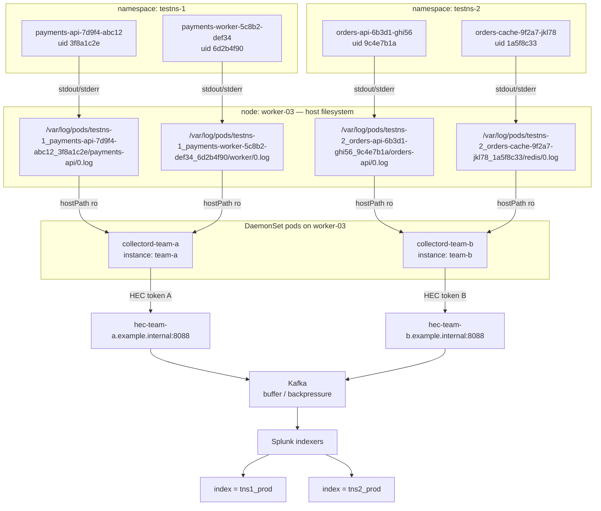

# Collectord — Multi-Instance Log Pipeline

Node-level log agent → Splunk HEC. Instance-based Helm chart, one DaemonSet per
pipeline, namespace-scoped routing.

---

## Flow

Worked example: one node, two namespaces, two pods each.

```
NODE  worker-03
════════════════════════════════════════════════════════════════════════════════

  namespace: testns-1                        namespace: testns-2
  ┌─────────────────────────────┐            ┌─────────────────────────────┐
  │ payments-api-7d9f4-abc12    │            │ orders-api-6b3d1-ghi56      │
  │ uid  3f8a1c2e-...-9d41      │            │ uid  9c4e7b1a-...-2e77      │
  │ container: payments-api     │            │ container: orders-api       │
  └──────────────┬──────────────┘            └──────────────┬──────────────┘
  ┌─────────────────────────────┐            ┌─────────────────────────────┐
  │ payments-worker-5c8b2-def34 │            │ orders-cache-9f2a7-jkl78    │
  │ uid  6d2b4f90-...-a1c3      │            │ uid  1a5f8c33-...-b0e9      │
  │ container: worker           │            │ container: redis            │
  └──────────────┬──────────────┘            └──────────────┬──────────────┘
                 │                                          │
                 └────────────  stdout / stderr  ───────────┘
                                     │
                                     ▼
                        CRI-O writes to the node fs
                                     │
  /var/log/pods/testns-1_payments-api-7d9f4-abc12_3f8a1c2e-...-9d41/payments-api/0.log
  /var/log/pods/testns-1_payments-worker-5c8b2-def34_6d2b4f90-...-a1c3/worker/0.log
  /var/log/pods/testns-2_orders-api-6b3d1-ghi56_9c4e7b1a-...-2e77/orders-api/0.log
  /var/log/pods/testns-2_orders-cache-9f2a7-jkl78_1a5f8c33-...-b0e9/redis/0.log
                                     │
                                     │  hostPath mount, read-only
                                     │  /var/log/pods → /var/log/pods
                                     ▼
  ┌──────────────────────────┐  ┌──────────────────────────┐
  │ collectord-team-a        │  │ collectord-team-b        │   DaemonSet pods
  │ instance: team-a         │  │ instance: team-b         │   on this node
  │ tails testns-1 only      │  │ tails testns-2 only      │
  └────────────┬─────────────┘  └────────────┬─────────────┘
               │                             │
      reads Namespace + Pod annotations to pick index & output
               │                             │
               ▼                             ▼
   hec-team-a.example.internal:8088   hec-team-b.example.internal:8088
               │                             │
               └──────────────┬──────────────┘
                              ▼
                            Kafka                (buffer / backpressure)
                              ▼
                       Splunk indexers
                         ├── index = tns1_prod   ← testns-1
                         └── index = tns2_prod   ← testns-2
```

### The same thing as Mermaid



### Reading the path

```
/var/log/pods/testns-1_payments-api-7d9f4-abc12_3f8a1c2e-...-9d41/payments-api/0.log
              └──┬───┘ └────────┬─────────────┘ └────────┬──────┘ └─────┬─────┘ └─┬─┘
            namespace        pod name              pod UID          container   file
```

Two pods in the same namespace differ only by pod name + UID. The **UID** is what
makes it unique — delete and recreate `payments-api` with the same name and you
get a new UID, therefore a new directory, therefore a new file for the agent to
tail. That is why the position file keys on inode, not filename.

---

## 1. Paths on the node

```
/var/log/pods/<ns>_<pod>_<uid>/<container>/0.log     ← real file, CRI-O writes here
/var/log/containers/<pod>_<ns>_<container>-<id>.log  ← SYMLINK to the above
/var/lib/containers/storage/...                       ← overlay storage
/var/lib/collectord/                                  ← position (checkpoint) files
```

Rotation is done by **kubelet**, not the app:

```
containerLogMaxSize   10Mi    → 0.log rotates to 0.log.20260823-101500
containerLogMaxFiles  5       → oldest deleted
```

If the agent tails slower than a chatty pod rotates, those logs are **gone**.

Line format written by CRI-O:

```
2026-08-23T10:15:00.123456789Z stdout F this is the log message
└─ RFC3339Nano timestamp       │      └─ P = partial (line was split)
                               │         F = full
                               └─ stream: stdout | stderr
```

Lines over ~16KB get split into multiple `P` records + a final `F`. The agent
reassembles them.

---

## 2. How the DaemonSet pod reaches those files — hostPath

A container has its own **mount namespace** — it cannot see the node's
filesystem. `hostPath` bind-mounts a node directory into the pod.

```yaml
spec:
  volumes:
    - name: varlogpods
      hostPath:
        path: /var/log/pods          # the real log files
        type: Directory
    - name: varlogcontainers
      hostPath:
        path: /var/log/containers    # symlinks pointing into /var/log/pods
        type: Directory
    - name: varlibcontainers
      hostPath:
        path: /var/lib/containers    # overlay storage
    - name: position
      hostPath:
        path: /var/lib/collectord    # checkpoint files — MUST be writable
        type: DirectoryOrCreate

  containers:
    - name: collectord
      volumeMounts:
        - { name: varlogpods,       mountPath: /var/log/pods,      readOnly: true }
        - { name: varlogcontainers, mountPath: /var/log/containers, readOnly: true }
        - { name: varlibcontainers, mountPath: /var/lib/containers, readOnly: true }
        - { name: position,         mountPath: /var/lib/collectord }   # writable
```

**Why both `/var/log/containers` and `/var/log/pods`:** the first directory is
only symlinks. Mount it alone and every link resolves to a path that does not
exist inside the container. Mount both, at the **same paths** as on the host, so
the symlink targets line up.

**Position files must be writable.** They record inode + byte offset per file so
a restarted agent resumes instead of replaying. Lose them → gap or duplicate flood.

### What hostPath costs you

| | |
|---|---|
| Blast radius | The pod can read **every** container's logs on that node — all tenants |
| Node coupling | Pod is tied to node-local state; not portable |
| Privilege | Needs an elevated SCC on OpenShift; `restricted-v2` denies hostPath |
| SELinux | RHCOS labels block reads unless the pod runs `spc_t` / privileged |

Mitigation: platform-owned DaemonSet only, image from the internal registry,
explicit narrow SCC binding, tenants cannot deploy their own.

```yaml
serviceAccountName: collectord
securityContext:
  privileged: true          # or a custom SCC allowing hostPath + spc_t
tolerations:
  - operator: Exists        # cover master/infra/tainted nodes or they go dark
```

A missing toleration is the most common cause of "some nodes have no logs."

---

## 3. Instance-based Helm chart

One chart, N DaemonSets. Each instance is an independent pipeline: own HEC
endpoint, own token, own index, own node selector, own throughput budget.

```yaml
# values.yaml

# default pipeline — broad platform export
general:
  endpoint: https://hec.example.internal:8088
  token: <from Secret>
  index: platform_shared

# additional dedicated pipelines
instances:

  - name: team-a
    endpoint: https://hec-team-a.example.internal:8088
    tokenSecret:
      name: collectord-team-a-hec
      key: token
    index: team_a_prod
    namespaces:
      - team-a-prod
      - team-a-uat
    nodeSelector:
      node-role.kubernetes.io/worker: ""
    throughput: 2097152            # bytes/sec ceiling for this instance

  - name: team-b
    endpoint: https://hec-team-b.example.internal:8088
    tokenSecret:
      name: collectord-team-b-hec
      key: token
    index: team_b_prod
    namespaces:
      - team-b-prod
    nodeSelector:
      workload: team-b             # only runs on team-b's dedicated nodes
    throughput: 1048576
```

Result:

```
$ kubectl get ds -n logging
NAME                    DESIRED   READY
collectord               120       120     # generic — all nodes
collectord-team-a        120       120     # team-a namespaces only
collectord-team-b         18        18     # only nodes labelled workload=team-b
```

**Why separate instances instead of one agent with routing rules:**

| Reason | What it buys |
|---|---|
| Noisy neighbour | Per-instance throughput ceiling. One loud namespace can't delay everyone else's logs — during an incident, when it matters most |
| Security | Own HEC token + own index → Splunk RBAC decides who can read those logs |
| Cost | Splunk licences per GB/day; per-index volume = per-team chargeback |
| Blast radius | Restart or misconfigure one pipeline, the others keep shipping |

Cost of that: N× agent memory per node, N× file descriptors tailing the same
directory tree, and N DaemonSets to upgrade.

---

## 4. Annotation-based routing

Routing lives on **Namespace** and **Pod** metadata, not in the agent's config.
The agent watches the Kubernetes API for these annotations.

### Namespace level — applies to every pod in it

```yaml
apiVersion: v1
kind: Namespace
metadata:
  name: team-a-prod
  annotations:
    collectord.io/index: "team_a_prod"
    collectord.io/output: "team-a"        # selects the instance
```

### Pod level — overrides the namespace

```yaml
apiVersion: apps/v1
kind: Deployment
spec:
  template:
    metadata:
      annotations:
        collectord.io/index: "team_a_audit"          # different index
        collectord.io/logs-index: "team_a_debug"     # logs only
        collectord.io/logs--exclude: "true"          # drop entirely
```

### Container level — suffix the container name

```yaml
annotations:
  collectord.io/logs.sidecar--exclude: "true"   # drop the sidecar's logs only
  collectord.io/logs.app-index: "team_a_app"
```

**Precedence:** container > pod > namespace > instance default > generic default.

### Why annotations instead of a config file

Onboarding a team = one annotation on their namespace. No PR against platform
config, no agent restart, no ticket. **The platform is an API, not a queue.**

**Tradeoff — say this before they ask:** tenants can now route themselves into
someone else's index. Enforce it with an admission policy:

```yaml
# Kyverno — a namespace may only select an index matching its own prefix
- name: restrict-log-index
  match:
    resources: { kinds: [Namespace] }
  validate:
    message: "index must match namespace prefix"
    pattern:
      metadata:
        annotations:
          collectord.io/index: "{{ request.object.metadata.name }}*"
```

---

## 5. Secrets

HEC token is a bearer credential — anyone holding it can write into your index,
and Splunk bills by ingested GB. Never in Git, never in values.yaml.

```yaml
# values.yaml holds a reference, not a value
tokenSecret:
  name: collectord-team-a-hec
  key: token
```

```yaml
# the Secret is rendered by Argo CD Vault Plugin at sync time
apiVersion: v1
kind: Secret
metadata:
  name: collectord-team-a-hec
stringData:
  token: <path:secret/data/logging/team-a#hec_token>
```

Git holds the Vault path. The value never touches the repo, and Git history is
forever — a leaked token committed once is leaked permanently.

---

## 6. Failure modes

| Symptom | Cause | Check |
|---|---|---|
| Gaps in logs | kubelet rotated faster than the agent tailed | `containerLogMaxSize`, agent throughput |
| Full replay after restart | position file lost | is `/var/lib/collectord` hostPath writable? |
| Node has no logs at all | missing toleration for that node's taint | `kubectl get ds -o yaml \| grep -A5 tolerations` |
| `permission denied` on start | SCC denies hostPath, or SELinux label | pod's `openshift.io/scc` annotation |
| Silent drop, no errors visible | HEC 4xx — bad token, index doesn't exist | agent error rate metric |
| Node DiskPressure | sink down, disk buffer growing | buffer depth metric |
| Duplicate events | retry after partial send | expected — delivery is **at-least-once** |
| Stack traces split | multiline not reassembled | prefer structured JSON logging |

**Monitor with an independent signal.** Do not watch the pipeline using the thing
the pipeline feeds. Scrape the agent's Prometheus metrics (events/sec, buffer
depth, send errors, position lag) and run a **canary pod** that logs a known
heartbeat — alert if it doesn't appear in the index within N seconds. That's
end-to-end; "is the pod Running" is not.

---

## 7. Commands

```bash
kubectl get ds -n logging
kubectl get ds collectord-team-a -n logging \
  -o jsonpath='{.status.desiredNumberScheduled}/{.status.numberReady}{"\n"}'

# which SCC admitted the pod
kubectl get pod <p> -n logging \
  -o jsonpath='{.metadata.annotations.openshift\.io/scc}{"\n"}'

# what the agent actually sees through the mount
kubectl exec -n logging <p> -- ls -la /var/log/pods | head
kubectl exec -n logging <p> -- cat /var/lib/collectord/position

# on the node itself
oc debug node/<n> -- chroot /host ls -la /var/log/containers | head
oc debug node/<n> -- chroot /host du -sh /var/log/pods

# routing in effect
kubectl get ns team-a-prod -o jsonpath='{.metadata.annotations}{"\n"}'

kubectl logs -n logging <collectord-pod> | grep -iE "error|denied|429|4[0-9][0-9]"
```

---

## Interview one-liners

- **DaemonSet not sidecar:** logs must outlive the process that wrote them. An
  app that ships its own logs loses them exactly when it crashes.
- **hostPath is the tradeoff:** the agent can read every tenant's logs on that
  node. That's why it's platform-owned and tenants can't deploy their own.
- **Instances = isolation:** throughput, index RBAC, and chargeback, in one
  mechanism.
- **Annotations = self-service**, with an admission policy as the guardrail.
- **Kafka = spike absorption.** Log volume peaks during incidents, which is
  precisely when the indexers are least able to keep up.
- **At-least-once.** Claiming exactly-once is a tell that you haven't run one.
