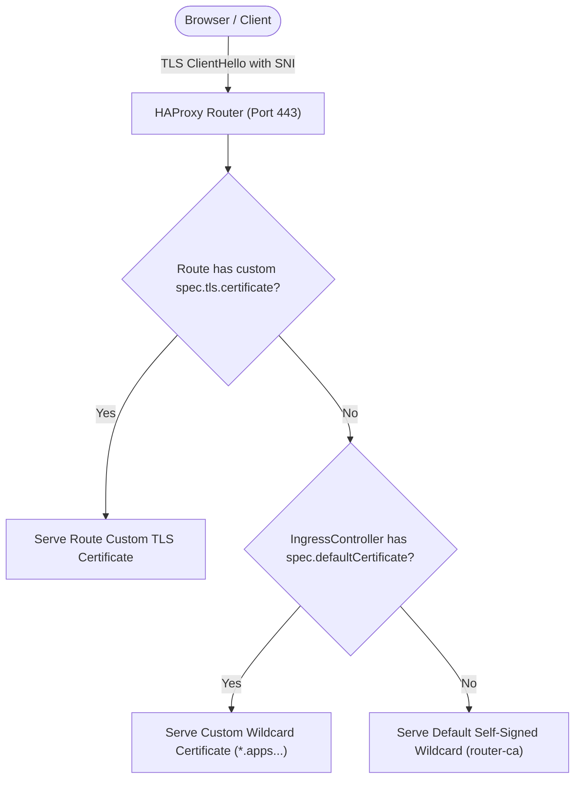

# OpenShift Ingress & Custom TLS Certificates — Rapid Interview Cheat-Sheet

## 1. The 30-Second Elevator Pitch

> "In OpenShift 4, the Ingress Operator manages HAProxy router pods dynamically. Out of the box, it mints a self-signed Root CA (`router-ca`) that issues a wildcard certificate for `*.apps.<cluster>.<domain>`. In production, this causes browser security warnings (`NET::ERR_CERT_AUTHORITY_INVALID`). We resolve this by acquiring an enterprise or publicly trusted wildcard certificate (e.g., via Let's Encrypt / Cert-Manager / DigiCert), creating a TLS secret in `openshift-ingress`, and referencing it under `spec.defaultCertificate.name` on the `ingresscontroller/default` CR in `openshift-ingress-operator`. The Ingress Operator mounts the new certificate into HAProxy and executes a graceful master-worker zero-downtime reload (`SIGUSR1`) without dropping in-flight TCP sessions."

---

## 2. Core Components & Architectural Roles

| Component | Kind / API Version | Namespace | Responsibility |
| :--- | :--- | :--- | :--- |
| **Ingress Operator** | `ClusterOperator` (`ingress`) | `openshift-ingress-operator` | Reconciles `IngressController` CRs, watches route changes, and manages router daemonsets/deployments. |
| **IngressController** | `ingresscontrollers.operator.openshift.io/v1` | `openshift-ingress-operator` | Custom Resource declaring router configuration: domain, replicas, node placement, and `spec.defaultCertificate`. |
| **Router Secret** | `Secret` (`kubernetes.io/tls`) | `openshift-ingress` | Houses the `tls.crt` (full chain) and `tls.key` for the wildcard apps domain. |
| **Router Pods** | `Deployment` (`router-default`) | `openshift-ingress` | Runs HAProxy container serving Layer 4 / Layer 7 ingress traffic. |
| **Service CA** | Internal Cluster CA | `openshift-service-ca` | Issues internal TLS certificates for backend pods in Re-encrypt routes. |

---

## 3. Wire-Level Mechanics & Certificate Precedence

### Certificate Selection Precedence in HAProxy:
When an incoming TLS connection hits the HAProxy router, HAProxy inspects the **SNI (Server Name Indication)** in the `ClientHello`:



1. **Route-Specific Certificate:** If a Route defines `spec.tls.certificate` and `spec.tls.key` (Edge or Re-encrypt), HAProxy serves that exact certificate.
2. **IngressController Default Certificate:** If the Route does not define custom certificates, HAProxy falls back to `spec.defaultCertificate.name` defined on the `IngressController`.
3. **Internal Self-Signed Fallback:** If `spec.defaultCertificate` is unset, HAProxy serves the self-signed wildcard certificate signed by the internal `router-ca`.

### Graceful Certificate Reload Mechanics:
* Changing `spec.defaultCertificate` is a **Tier 2 structural change**.
* The Ingress Operator updates the router Deployment / Pod volume mount.
* HAProxy runs in **Master-Worker mode (`haproxy -W`)**:
  1. Master process reads new config & certificates from disk.
  2. Master forks a **New Worker** process bound to port 80/443.
  3. Master sends `SIGUSR1` to the **Old Worker**.
  4. Old Worker stops accepting new sockets, drains active HTTP/TLS keep-alive connections, and terminates cleanly.
  5. **Result:** Zero dropped packets, zero downtime.

---

## 4. Senior Interview Q&A (High-Yield Rapid Fire)

### Q1: Why do browsers throw `NET::ERR_CERT_AUTHORITY_INVALID` when opening the OpenShift console out-of-the-box?
**Answer:** OpenShift installs an internal Root CA (`router-ca`) in the `openshift-ingress-operator` namespace and self-signs `*.apps.<cluster>.<baseDomain>`. Because this CA is not trusted by public operating system trust stores (Mozilla NSS, Apple Keychain, Windows Root Store), browsers reject it as untrusted.

### Q2: How do you configure a custom wildcard certificate for the entire cluster's default routes?
**Answer:**
1. Generate or receive the valid wildcard TLS certificate (`tls.crt` containing full certificate chain + intermediate CAs, and `tls.key`).
2. Create a Kubernetes TLS secret in the **`openshift-ingress`** namespace:
   ```bash
   oc create secret tls custom-certs-default --cert=fullchain.pem --key=privkey.pem -n openshift-ingress
   ```
3. Patch the `default` IngressController in **`openshift-ingress-operator`**:
   ```bash
   oc patch ingresscontroller.operator default \
     --type=merge \
     -p '{"spec":{"defaultCertificate":{"name":"custom-certs-default"}}}' \
     -n openshift-ingress-operator
   ```
4. Verify the router deployment rollout in `openshift-ingress`.

### Q3: What is the difference between fixing this via `spec.defaultCertificate` vs. adding the CA to macOS Keychain?
**Answer:**
* **`spec.defaultCertificate` (Production / Ingress Level):** Fixes the issue globally on the server side. Every user, client, mobile device, or pipeline connecting to `*.apps.<domain>` trusts the connection automatically without any local client modification.
* **Local Keychain Trust (Dev/Lab Level):** Imports the cluster's internal `router-ca` into the developer's local machine trust store. It satisfies the browser on that specific machine only, leaving external clients and team members untrusted.

### Q4: In an automated enterprise environment, how do you handle certificate lifecycle and auto-renewal for OpenShift ingress?
**Answer:**
Deploy **`cert-manager`** (Red Hat OpenShift cert-manager Operator). Configure a `ClusterIssuer` using ACME (Let's Encrypt with DNS-01 challenges via Cloud DNS / Route53) or an enterprise PKI / HashiCorp Vault / AWS Private CA. Cert-manager automatically monitors certificate expiration (e.g. 30 days before expiry), requests renewal, updates the secret in `openshift-ingress`, and the Ingress Operator triggers HAProxy reload.
